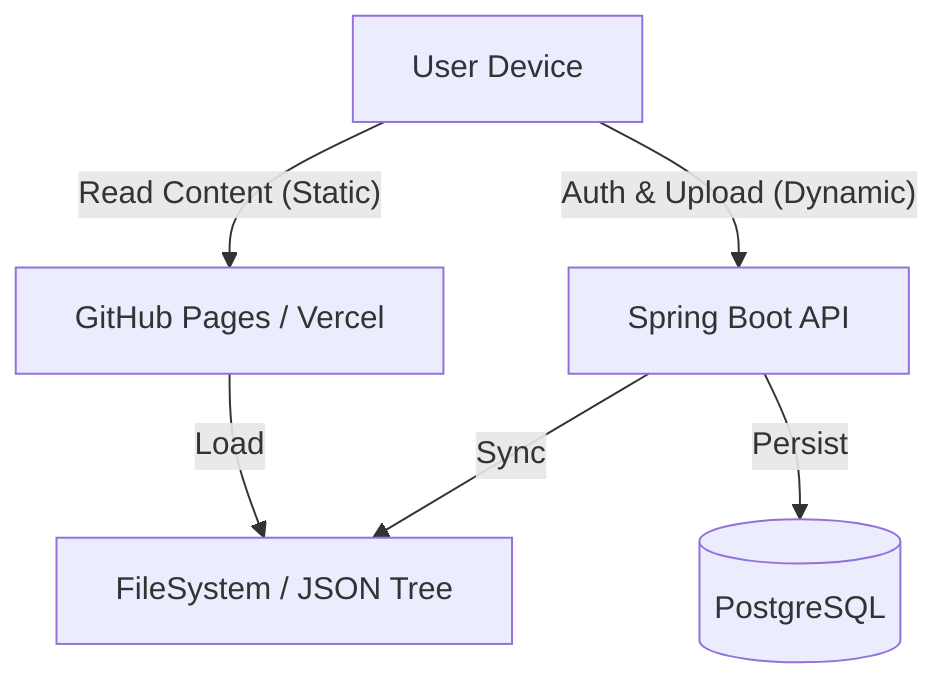

# StudentNotes

**StudentNotes** is a production-grade, hybrid academic documentation platform designed to serve high-quality study materials to students with zero latency, regardless of network conditions.

It functions as a dual-mode system:
1.  **Static Mode (Default)**: A completely serverless, filesystem-based read-only site (via GitHub Pages).
2.  **Dynamic Mode**: A full-stack application (Spring Boot + PostgreSQL) enabling teacher uploads, user management, and advanced analytics.

This hybrid architecture ensures that *content availability* is decoupled from *backend availability*.

---

## Architecture Overview

The system follows a **Mobile-First, Offline-First** philosophy.



### Key Technical Decisions

*   **Hybrid Data Source**: The frontend is "API-agnostic". It attempts to handshake with the backend on startup. If the backend is unreachable (or 404), it gracefully degrades to `Static Mode`, serving pre-compiled Markdown/JSON from the `public/` directory. This guarantees 100% uptime for readers.
*   **Ethical Loaders**: We implement artificial delays (1.5s - 2.5s) during "premium" actions (like PDF export) to pace the user experience and present non-intrusive calls-to-action (e.g., GitHub Stars). This uses `useEthicalDelay` hook logic which respects user session history.
*   **Semantic Versioning for Notes**: The backend implements a strict state machine for Note lifecycles (`DRAFT` -> `PUBLISHED` -> `ARCHIVED`) to prevent accidental data leaks.

---

## 🛠 Tech Stack & Justification

### Frontend (`/Frontend`)
*   **React 19 + TypeScript**: For strict type safety in our recursive folder structures.
*   **Vite**: For instant HMR and optimized production builds.
*   **Tailwind CSS**: For a unified, token-based design system that ensures mobile responsiveness (360px baseline).
*   **Framer Motion**: To provide "MAANG-level" micro-interactions (staggered list reveals, page transitions) that enhance perceived performance.
*   **KaTeX & React Markdown**: For rendering complex STEM formulas and code blocks client-side.

### Backend (`/Backend`)
*   **Java 21 + Spring Boot 3**: Chosen for robustness, strict thread-safety, and enterprise-grade security libraries.
*   **PostgreSQL**: Relational integrity is non-negotiable for user role management and audit logs.
*   **Spring Security + JWT**: Stateless authentication allowing the backend to scale horizontally if needed.
*   **Hibernate/JPA**: For consistent ORM mapping and preventing SQL injection.

---

## 🚀 Getting Started

### Prerequisites
*   Node.js 18+
*   Java 21 JDK
*   Maven 3.8+
*   PostgreSQL 14+

### Running Locally (Full Stack)

1.  **Start Database**
    Ensure PostgreSQL is running on port `5432` with a database named `studentnotes_db`.

2.  **Start Backend**
    ```bash
    cd Backend
    # The app will wipe/recreate DB schema on first run (configurable in application.properties)
    mvn spring-boot:run
    ```
    *API will run on `http://localhost:8080`*

3.  **Start Frontend**
    ```bash
    cd Frontend
    npm install
    npm run dev
    ```
    *App will run on `http://localhost:5173`*

    *Note: The frontend will auto-detect the backend at port 8080. If detected, the "Sign In" button will appear.*

### Running Static Mode (Frontend Only)
Simply run the frontend without the backend.
```bash
cd Frontend
npm run dev
```
The application will log `⚠️ Backend OFFLINE. Fallback to Static Filesystem.` and function as a read-only documentation site.

---

## 🔒 Security Model

*   **Role-Based Access Control (RBAC)**:
    *   `ROLE_STUDENT`: Read-only access to PUBLISHED notes.
    *   `ROLE_TEACHER`: Can upload notes (DRAFT), request deletions. Cannot purge data.
    *   `ROLE_ADMIN`: Can approve deletions, manage users, and force-edit content.
*   **Audit Logging**: Critical actions (Deletions, Role Changes) are written to an append-only `audit_log` table.
*   **Rate Limiting**: The backend implements a simple token-bucket rate limiter to prevent abuse of the Upload API.

---

## 📂 Project Structure

```
.
├── Backend/
│   ├── src/main/java/com/studentnotes/
│   │   ├── config/       # Security & App Config
│   │   ├── controller/   # REST Endpoints
│   │   ├── model/        # JPA Entities
│   │   ├── service/      # Business Logic
│   │   └── repository/   # Data Access
│   └── src/test/         # JUnit 5 Integration Tests
│
├── Frontend/
│   ├── src/
│   │   ├── components/   # Atomic UI Components
│   │   ├── context/      # Global State (Auth, Data)
│   │   ├── hooks/        # Custom Logic (useEthicalDelay)
│   │   ├── pages/        # Route Views
│   │   └── utils/        # Helpers (PDF, Tree Parsers)
│   └── public/           # Static Assets
```

---

## ⚠️ Trade-offs & Constraints

1.  **Search Indexing**: Currently, search is client-side only (filtering the recursive tree). This works for <5000 notes but will require server-side indexing (Elasticsearch) for larger datasets.
2.  **PDF Generation**: Done client-side (`html2canvas` + `jspdf`). This saves server costs but depends on the client's device power.
3.  **Consistency**: In Static Mode, content is only as fresh as the last build deployment. Dynamic Mode is real-time.

---

## License

This project is licensed under the MIT License.
StudentNotes is an open-source initiative.